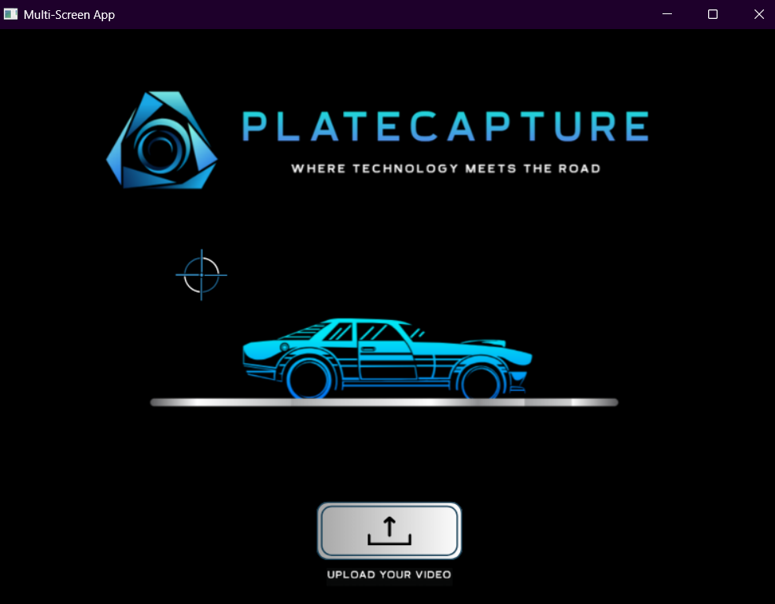

# Automatic License Plate Recognition System

An advanced computer vision application for automatic vehicle detection, tracking, and license plate recognition in video streams. Built with PyQt6, YOLOv8, and EasyOCR.

## 🚀 Features

- **Multi-Screen GUI Application**: Intuitive PyQt6-based interface with multiple screens for different functionalities
- **Vehicle Detection**: Real-time vehicle detection using YOLOv8 model
- **License Plate Detection**: Custom-trained YOLO model for accurate license plate detection
- **Vehicle Tracking**: SORT (Simple Online and Realtime Tracking) algorithm for consistent vehicle tracking across frames
- **OCR Text Recognition**: EasyOCR integration for extracting text from license plates
- **Format Validation**: Specialized validation for UK license plate format (AA##AAA)
- **Video Processing**: Complete video analysis with progress tracking
- **Result Export**: CSV export functionality for detected license plates
- **Video Visualization**: Annotated video output with bounding boxes and license plate information
- **Data Interpolation**: Missing frame data interpolation for smooth tracking results

<div align="center">
  
</div>


## 🛠️ Technologies Used

- **GUI Framework**: PyQt6
- **Computer Vision**: OpenCV
- **Object Detection**: YOLOv8 (Ultralytics)
- **OCR**: EasyOCR
- **Object Tracking**: SORT Algorithm
- **Data Processing**: Pandas, NumPy
- **Video Processing**: OpenCV, PyQt6 Multimedia
- **Machine Learning**: PyTorch

## 📋 Requirements

### System Requirements
- Python 3.8 or higher
- Windows/Linux/macOS
- GPU support recommended for better performance

### Dependencies
```bash
# Core Computer Vision Libraries
opencv-python>=4.5.0
ultralytics>=8.0.0
numpy>=1.21.0
scipy>=1.7.0

# GUI Framework
PyQt6>=6.4.0
PyQt6-Qt6>=6.4.0

# Machine Learning and OCR
easyocr>=1.6.0
torch>=1.9.0
torchvision>=0.10.0

# Data Processing
pandas>=1.3.0
openpyxl>=3.0.0

# Image Processing
Pillow>=8.0.0

# Additional Dependencies
matplotlib>=3.5.0
requests>=2.25.0
tqdm>=4.62.0
PyYAML>=5.4.0
psutil>=5.0.0

# For SORT tracking algorithm
filterpy>=1.4.5
scikit-image>=0.18.0

# System utilities
packaging>=21.0
```

## 🚀 Installation

1. **Clone the repository**
   ```bash
   git clone <repository-url>
   cd CV-APP
   ```

2. **Create a virtual environment** (recommended)
   ```bash
   python -m venv cv_env
   source cv_env/bin/activate  # On Windows: cv_env\Scripts\activate
   ```

3. **Install dependencies**
   ```bash
   pip install -r requirements.txt
   ```

4. **Download required models**
   - Ensure `yolov8n.pt` (YOLOv8 Nano model) is in the project directory
   - Ensure `license_plate_detector.pt` (custom license plate detection model) is in the project directory

## 🎯 Usage

### Running the Application

```bash
python main.py
```

### Application Workflow

1. **Main Screen**: Upload a video file
   - Click the upload area to select a video file
   - Supported formats: MP4, AVI, MKV, MOV, FLV

2. **Processing Screen**: Video analysis
   - The application processes the video frame by frame
   - Progress bar shows real-time processing status
   - Vehicle detection, license plate detection, and OCR are performed
   
<div align="center">
  
</div>

3. **Results Screen**: View and export results
   - **Save Plates File**: Export detected license plates to CSV
   - **Visualize the Plates Video**: Generate annotated video with detection results

4. **Video Player Screen**: Watch processed video
   - Play the annotated video with bounding boxes
   - Navigate back to previous screens

<div align="center">
  
</div>
### Output Files

The application generates several output files:

- `{video_name}_results.csv`: Detailed detection results for all frames
- `{video_name}_plates.csv`: Filtered license plate results with highest confidence scores
- `{video_name}_results_interpolated.csv`: Interpolated data for missing frames
- `{video_name}_out.mp4`: Annotated video with detection visualizations

## 📊 CSV Output Format

### Plates CSV (`{video_name}_plates.csv`)
| Column | Description |
|--------|-------------|
| car_id | Unique identifier for each tracked vehicle |
| license_number | Recognized license plate text |
| license_number_score | Confidence score for the OCR recognition |

### Results CSV (`{video_name}_results.csv`)
| Column | Description |
|--------|-------------|
| frame_nmr | Frame number in the video |
| car_id | Unique identifier for each tracked vehicle |
| car_bbox | Bounding box coordinates for the vehicle |
| license_plate_bbox | Bounding box coordinates for the license plate |
| license_plate_bbox_score | Confidence score for license plate detection |
| license_number | Recognized license plate text |
| license_number_score | Confidence score for OCR recognition |

## 🧠 Technical Architecture

### Core Components

1. **Main Application (`main.py`)**
   - Entry point and window management
   - QStackedWidget for screen navigation

2. **GUI Screens**
   - `main_window.py`: File upload interface
   - `second_window.py`: Processing screen with progress tracking
   - `third_window.py`: Results management and export
   - `fourth_window.py`: Video player for annotated output

3. **Computer Vision Engine (`Function.py`)**
   - `Plate_detection()`: Main detection pipeline
   - `interpolate_csv()`: Data interpolation for missing frames
   - `process_video()`: Video annotation and output generation

4. **Utility Functions (`util.py`)**
   - License plate format validation
   - Character mapping and correction
   - CSV writing and data management
   - Vehicle-license plate association

### Detection Pipeline

1. **Frame Processing**: Extract frames from input video
2. **Vehicle Detection**: YOLOv8 detects vehicles (cars, trucks, buses, motorcycles)
3. **Object Tracking**: SORT algorithm maintains vehicle identities across frames
4. **License Plate Detection**: Custom YOLO model locates license plates
5. **Text Recognition**: EasyOCR extracts text from license plate regions
6. **Format Validation**: Validates UK license plate format (AA##AAA)
7. **Data Association**: Links license plates to tracked vehicles
8. **Result Storage**: Saves detection results and metadata

### Key Algorithms

- **YOLOv8**: State-of-the-art object detection for vehicles and license plates
- **SORT Tracking**: Simple Online and Realtime Tracking for vehicle identity persistence
- **EasyOCR**: Robust optical character recognition for text extraction
- **Scipy Interpolation**: Linear interpolation for missing tracking data

## 🎛️ Configuration

### License Plate Format

The system is currently optimized for UK license plate format:
- Pattern: `AA##AAA` (2 letters, 2 numbers, 3 letters)
- Length: 7 characters
- Example: `AB12CDE`

To support other formats, modify the `license_complies_format()` function in `util.py`.

### Detection Parameters

Key parameters can be adjusted in `Function.py`:
- Vehicle classes: `vehicles = [2, 3, 5, 7]` (car, motorcycle, bus, truck)
- OCR threshold: Modify threshold in `cv2.threshold()` for license plate preprocessing
- Confidence thresholds: Adjust YOLO detection confidence levels


### Performance Optimization

- **GPU Acceleration**: Enable GPU for faster processing
- **Batch Processing**: Process multiple videos sequentially
- **Model Optimization**: Use smaller YOLO models (nano vs. large) for speed/accuracy trade-off
- **Frame Sampling**: Process every nth frame for faster results

## 📈 Future Enhancements

- [ ] Support for multiple license plate formats (EU, US, etc.)
- [ ] Real-time camera feed processing
- [ ] Database integration for license plate database queries
- [ ] Advanced analytics and reporting
- [ ] Multi-language OCR support
- [ ] Cloud deployment capabilities
- [ ] API endpoints for integration with other systems

## 📄 License

This project is developed for educational purposes as part of a university course in Computer Vision.
Academic Year : 2024 - 2025

## 🙏 Acknowledgments

- **Ultralytics**: YOLOv8 implementation
- **EasyOCR**: OCR library
- **SORT**: Object tracking algorithm
- **PyQt6**: GUI framework
- **OpenCV**: Computer vision library


---

**Project developed by**: Wiame Adnane & Abderrahmane Najib
**Course**: Computer Vision Project
**Institution**: UEMF